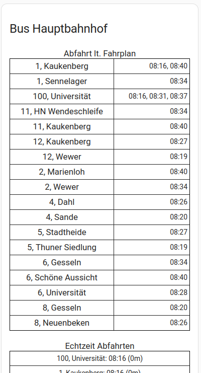

# Padersprinter Home Assistant sensor

This sensor uses official API provided by Padersprinter in Paderborn, Germany.



Thanks to [Piotr Machowski](https://github.com/PiotrMachowski) who implemented the [MPK Kraków sensor](https://github.com/PiotrMachowski/Home-Assistant-custom-components-MPK-KR). Obviously, Kraków, Poland is using the same information system as Paderborn. 


## Example usage

```
sensor:
  - platform: padersprinter
    stops:
      - id: 1000 # Hauptbahnhof
        lines:
          - "1"
      - id: 1001 # Westerntor
        mode: arrival
        directions:
          - "Gesseln"
```
Value for `id` can be retrieved from [*stations.md*](https://github.com/AlbrechtL/hass-padersprinter/blob/master/stations.md).


#### Configuration options

| Key | Type | Required | Default | Description |
| --- | --- | --- | --- | --- |
| `name` | `string` | `False` | `Padersprinter` | Name of sensor |
| `stops` | `list` | `True` | - | List of stop configurations |

#### Stop configuration

| Key | Type | Required | Default | Description |
| --- | --- | --- | --- | --- |
| `id` | `positive integer` | `True` | - | ID of a stop. See [*stations.md*](https://github.com/AlbrechtL/hass-padersprinter/blob/master/stations.md) |
| `mode` | `string` | `False` | `departure` | One of `departure` or `arrival` |
| `name` | `string` | `False` | id | Name of a stop |
| `lines` | `list` | `False` | all available | List of monitored lines. |
| `directions` | `list` | `False` | all available | List of monitored directions. |

## Dashboard

These sensors provides attributes which can be used in [*HTML card*](https://github.com/PiotrMachowski/Home-Assistant-Lovelace-HTML-card) (recommend install via HACS): `html_timetable`, `html_departures`
  * HTML card:
    ```yaml
    type: custom:html-card
    title: Bus Hauptbahnhof
    content: |
      <big><center>Abfahrt lt. Fahrplan</center></big>
      [[ sensor.padersprinter_1000_departure.attributes.html_timetable ]]
      <br>
      <big><center>Echtzeit Abfahrten</center></big>
      [[ sensor.padersprinter_1000_departure.attributes.html_departures ]]
    ```

## Installation

#### Using [HACS](https://hacs.xyz/) (recommended)

This integration can be added to HACS as a [custom repository](https://hacs.xyz/docs/faq/custom_repositories):
* URL: `https://github.com/AlbrechtL/hass-padersprinter`
* Category: `Integration`

After adding a custom repository you can use HACS to install this integration using user interface.

#### Manual

To install this integration manually you have to download [*padersprinter.zip*](https://github.com/AlbrechtL/hass-padersprinter/releases/latest/download/padersprinter.zip) and extract its contents to `config/custom_components/padersprinter` directory:
```bash
mkdir -p custom_components/padersprinter
cd custom_components/padersprinter
wget https://github.com/AlbrechtL/hass-padersprinter/releases/latest/download/padersprinter.zip
unzip padersprinter.zip
rm padersprinter.zip
```

## HACS integration status
* [ ] HACS integration: https://github.com/hacs/default/pull/2941 (open)
* [x] Home Assistant brands (logos and icons) integration: [https://github.com/hacs/default/pull/2941](https://github.com/home-assistant/brands/pull/6247) (merged)

## Padersprinter API

* Get current bus information per station in JSON format
  ```
  curl 'https://www.padersprinter.de/internetservice/services/passageInfo/stopPassages/stop' -X POST --data-raw 'stop=1000'
  ```

* Get all Padersprinter stations in JSON format
  ```
  curl 'https://www.padersprinter.de/internetservice/geoserviceDispatcher/services/stopinfo/stops' -X POST --data-raw 'left=-648000000&bottom=-324000000&right=648000000&top=324000000'
  ```

* Get current bus locations
  ```
  curl 'https://www.padersprinter.de/internetservice/geoserviceDispatcher/services/vehicleinfo/vehicles' -X POST
  ```

## Acknowledgement

I would like to thanks to following projects. Without these great work this Padersprinter Home Assistant component would not be possible.
* [MPK Kraków sensor](https://github.com/PiotrMachowski/Home-Assistant-custom-components-MPK-KR)
* [Kraków TTSS-documentation](https://github.com/Delay-Team/Cracow-Public-Transport-Dashboard/wiki/TTSS-documentation)
* https://aczepielik.github.io/post/kraktram/
